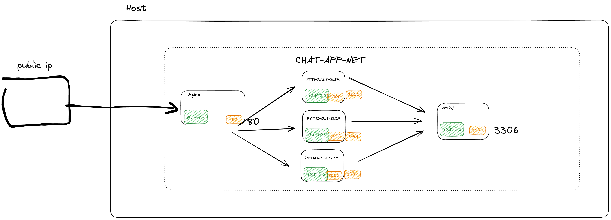

# Chat-App-DevOps Training

This repository contains a chat service application built using Flask and MySQL. The application allows users to send and receive messages in real-time.

## About the Service:
### The service exposes three apis:
1. `GET /<room>` - Will return the static HTML (provided to you), regardless of the room provided.
2. `POST /chat/<room>` - Accepts a chat line from a user:
   - Will accept 2 form fields - username & message.
   - Will save date, time, username & message per room.
3. `GET /chat/<room>` - Returns the full chat in a room:
   - Chat formatted as a list of "\n" delimited lines (1 per message).
   - Each line formatted according to the example: "[2018-02-25 14:00:51] omri: hi everybody!"


## Running the Project
To run the project, follow these steps:

1. Clone the repository to your local machine:
    ```
    git clone https://github.com/elior7557/Chat-App.git
    ```
2. Change into the project directory:
   ```
   cd Chat-App
   ```
3. Run the docker compose to start the application:
      ```
   docker compose up -d
   ```

   This script will start the Flask and MySQL containers and run the necessary setup steps to create the database and tables.

4.  Once the script has finished running, you can access the application by visiting http://localhost:80 in your web browser.


## App Architecture 




enjoy:) !


